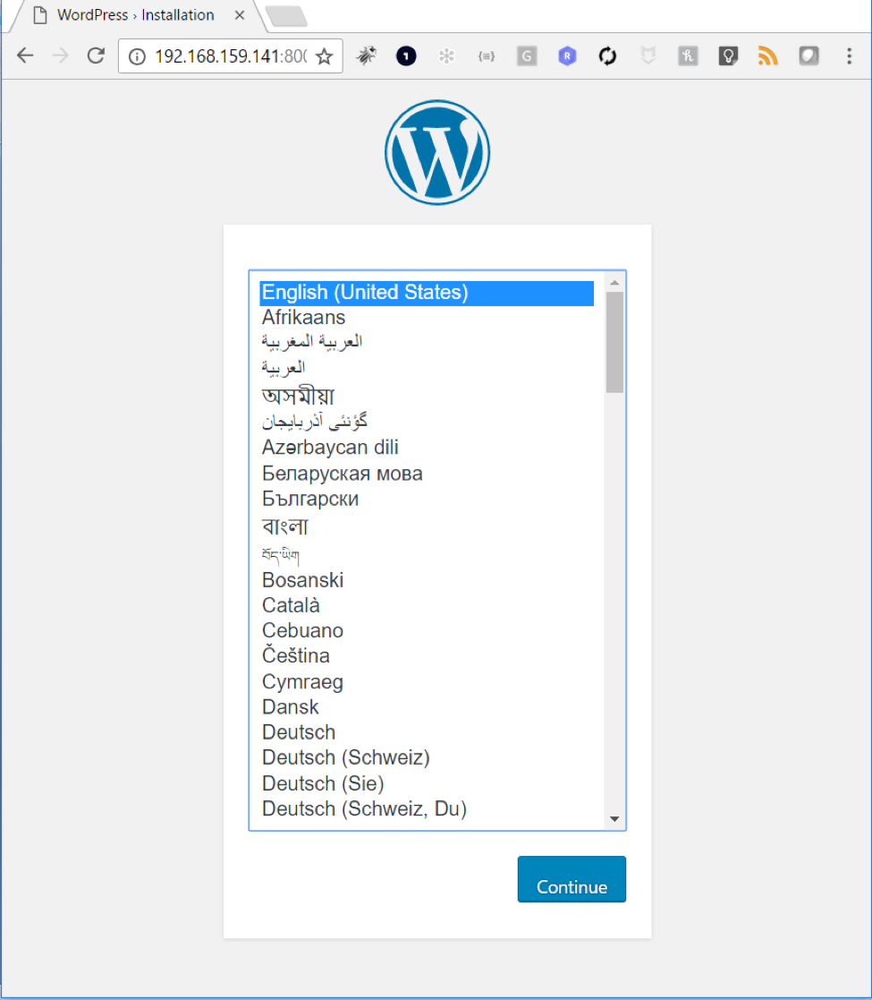

In this example we are going to run a Wordpress stack with Maria DB as the backend for data persistence. The example does not use any clustering technology such as Swarm mode. The idea is here to simply demonstrate the usage of volumes in docker-compose specs

Before we do anything, let's check for presence of volumes:


```
# docker volume ls
DRIVER              VOLUME NAME
```


To deploy the application we will use following docker-compose file. We have two containers - one for frontend Wordpress & another for backend Maria DB. The Maria DB container uses a volumes named ```db_data``` which is defined in the volumes section with vSphere as driver and 1GB space.

```
version: '2'

services:
   db:
     image: mariadb
     volumes:
       - db_data:/var/lib/mysql
     restart: always
     environment:
       MYSQL_ROOT_PASSWORD: wordpress
       MYSQL_DATABASE: wordpress
       MYSQL_USER: wordpress
       MYSQL_PASSWORD: wordpress
   wordpress:
     depends_on:
       - db
     image: wordpress:latest
     ports:
       - "8000:80"
     restart: always
     environment:
       WORDPRESS_DB_HOST: db:3306
       WORDPRESS_DB_PASSWORD: wordpress
volumes:
    db_data:
       driver: vsphere
       driver_opts:
         size: 1Gb

```

When we run ```docker-compose up``` on a VM we can see output similar to one the below:

```
# docker-compose up -d
Creating network "wordpress_default" with the default driver
Creating volume "wordpress_db_data" with vsphere driver
Creating wordpress_db_1
Creating wordpress_wordpress_1
```


Now if we check for presence of volume - we can see

```
# docker volume ls
DRIVER              VOLUME NAME
local               c20144fdfcfd2b6fe5defa3b87410723cd892aedd17a503c66f2abfa6e2cfb2c
vsphere             wordpress_db_data@datastore3
```

Let us inspect the docker volume that has been created for the MariaDB.

```
# docker volume inspect wordpress_db_data
[
    {
        "Name": "wordpress_db_data",
        "Driver": "vsphere",
        "Mountpoint": "/mnt/vmdk/wordpress_db_data",
        "Status": {
            "access": "read-write",
            "attach-as": "independent_persistent",
            "attached to VM": "Photon5",
            "capacity": {
                "allocated": "169MB",
                "size": "1GB"
            },
            "clone-from": "None",
            "created": "Mon Apr 10 15:05:06 2017",
            "created by VM": "Photon5",
            "datastore": "datastore3",
            "diskformat": "thin",
            "fstype": "ext4",
            "status": "attached"
        },
        "Labels": null,
        "Scope": "global"
    }
]
```
Finally as a quick way to check if the stack is up and running properly, we can hit the Wordpress frontend on hostname:8080 and see the Wordpress UI:


