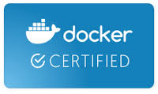

vDVS is fully compatible with Docker and this section demonstrates working examples with docker's commands and concepts.

## Docker Certified Plugin
vDVS is a docker certified plugin and it integrates with Docker volume plugin framework. You can also find details on the [Docker store](https://store.docker.com/plugins/vsphere-docker-volume-service)

## Docker Volume

vDVS plugin is fully compatible with docker volume command, you can find details and working example in [Management of docker volumes](docker-volume-cli.md)

## Docker-engine in Swarm mode

vDVS can be used with Docker Engine in swarm mode to build highly available and fault tolerant application with stateful data requirements. You can find an example and details on page [HA DB in docker swarm mode](demo-ha-swarm.md)

## Docker Service

Docker service is used to deploy applications that can run on docker engine in swarm mode in a distributed cluster. A docker service is typically part of a larger set of applications for example you might deploy an application server and database as a service. vDVS is fully compatible with docker service command and you can see working examples and details on [Docker Service with vSphere volumes page](docker-service.md)

## Docker Stack

A stack in docker terms is a collection of services. A stack can be used to define a complete application composed of multiple services. Docker stack enables defining dependencies between services, configuration parameters in one place for a complete application. vDVS is fully compatible with docker stack commands and working examples and details can be found [Docker Service with vSphere volumes page](docker-stacks.md)

