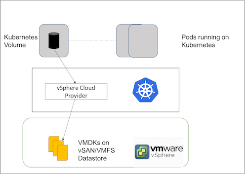

 
vSphere supports all the the Kubernetes storage primitives which brings enterprise grade storage to Kubernetes. vSphere uses vSAN and VMFS datastores, these datastores store the volumes as VMDK files.

Kubernetes volumes can be defined in Pod specification where they reference VMDK files and these VMDK files are mounted as volumes when the container is running. When the Pod is deleted the Kubernetes volume is unmounted and the data in VMDK files persists.

 
 
 
 
vSphere is cloud provider which implements Instances interface and supports following Kubernetes storages primitives:

* Volumes
* Persistent Volumes
* Persistent Volumes Claims
* Storage Class
* Stateful Sets
