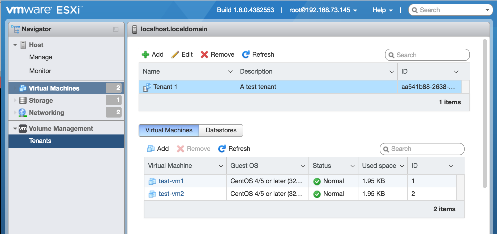

# ESX UI Plugin for vSphere Docker Volume Service

[vSphere Docker Volume Service](https://github.com/vmware/docker-volume-vsphere) bundles a  [vSphere Docker Volume ESX UI Plugin](https://github.com/vmware/docker-volume-vsphere/tree/master/ui) for the [ESXi Embedded Host Client](https://labs.vmware.com/flings/esxi-embedded-host-client). The plugin is used for creating and managing tenants that allow access to virtual machines and datastores available to the ESX host. As a plugin to the native ESX client, this capability is available in its sidebar navigator.



## Installation

The ESX UI Plugin is meant to be installed as part of the [vSphere Docker Volume Service ESX installation](https://github.com/vmware/docker-volume-vsphere#on-esx).

Eventually, a VIB built using make in the project root will include the UI Plugin by default. As of early December 2016, the UI Plugin is *NOT* included in the VIB by default. To override this default and include the plugin, run the following on the command line prior to running *make*.

```
export INCLUDE_UI=true
```


## Usage

### Supported Actions

The ESXUI Plugin allows the user to do complete the following actions.

1. Add new Tenant
	- with the optional UI feature allowing the user to associate one or more VMs with this newly-created Tenant


2. Remove a Tenant

3. Edit a Tenant
	- change name and description
	- feature currently (early Dec 2016) disabled pending release of associated backend api feature


4. View all VMs associated with a Tenant

5. View all Datastore Accesses associated with a Tenant

6. Add one or more VMs to a Tenant by choosing from all VMs available on the ESX host

7. Remove a VM from a Tenant

8. Add a Datastore Access to a Tenant by selecting a single Datastore (from those available on the host) and by assigning a set of access rights to that datastore. Tenant may have a default set of access rights that can be automatically applied.

9. Remove a Datastore Access from a Tenant

10. Modify a Datastore Access for a Tenant
	- change the access rights associated with the Datastore


## Development

### Current Status

In early December 2016 the initial phase of development for the UI Plugin was created, added to the project via this pull request:
https://github.com/vmware/docker-volume-vsphere/pull/780

As of this time, all of the 10 actions mentioned above are supported end-to-end. At this point, the associated VMODL capabilities in the API were not complete, so it wasn't possible to test the UI with live data. That the UI was making correct API calls and getting reasonable responses was well tested, but no data-driven integration testing has been done, not even manually. New UI or UI/API compatibility bugs may appear as that testing is done.


### Running ESX UI in Development

UI plugin development involves:
1. Modifying code in the /ui directory of the docker-volume-vsphere project
2. Building the UI plugin from that modified code
3. Deploying that build to an existing host to run and test the modified plugin

For a fresh repository, before steps 2 and 3 can be done, dependencies must be installed:

```
cd ./ui
npm install
```

To test the build process, try running:

```
grunt
```

If this fails it may be necessary to install grunt globally:

```
npm install -g grunt-cli
```

Here's a dev deployment script that may be used to automate deployment of the plugin to an established ESX host for development and testing (steps 2 & 3).

```
#!/bin/bash

# this script builds and installs the UI plugin to an existing ESX host, overwriting existing installation if present
# 1. First it runs the UI build process (by running grunt)
# 2. Then it deploys the result of that build process (./build/dist) as an ESXi UI plugin called docker-volume-plugin on the host
# 3. Finally, it starts the vsanmgmtd service (required for the UI to access necessary data) on the host

# CONFIGURATION
#
# set this to IP of host you want to install - for example:
ESX_IP=192.168.73.14
#
#

echo "deploying to ${ESX_IP}"

rm -rf build/dist/*
grunt --env=dev

SRC_PATH=.
PLUGIN_NAME=docker-volume-plugin
BUILD_PATH=${SRC_PATH}/build/dist
ssh root@${ESX_IP} mkdir /usr/lib/vmware/hostd/docroot/ui/plugins
ssh root@${ESX_IP} rm -rf /usr/lib/vmware/hostd/docroot/ui/plugins/${PLUGIN_NAME}/
scp -r ${BUILD_PATH}/. root@${ESX_IP}:/usr/lib/vmware/hostd/docroot/ui/plugins/${PLUGIN_NAME}/
ssh root@${ESX_IP} /etc/init.d/vsanmgmtd start

```

### Understanding the Source Code

The [vSphere Docker Volume ESX UI Plugin](https://github.com/vmware/docker-volume-vsphere/tree/master/ui) runs as a plugin within the [ESXi Embedded Host Client (ESXUI) ](https://labs.vmware.com/flings/esxi-embedded-host-client).

[ESXUI Plugin Documentation](https://wiki.eng.vmware.com/ESX/UI/PluginArchitecture) and [Example Plugin Source Code](https://git.eng.vmware.com/?p=esxui-example-plugin.git) are available with access permission from VMware.

ESXUI is an [Angular 1.3](https://angularjs.org/) app.

The most important file in the plugin is _ui/plugin.js_. The acts as manifest for the plugin. It's where dependencies are managed. It's where high-level configuration (e.g. context menu) is done.

The plugin extends this app by adding new Angular code:
- ./ui/views/
- ./ui/scripts/services/
- ./ui/scripts/controllers

The plugin takes full advantage of available ESXUI UI components: grid, context menu, dialog, etc. and associated styling. There's not a lot of new HTML and CSS added. The plugin is primarily the JS code required to configure standard ESXUI UI components and manage the flow of data to and from those components.

### API integration via SOAP

Getting the UI to make successful requests to the Vsan/VMODL API was tricky. The data access services available within ESXUI don't natively support connecting to Vsan backend services directly, so we implemented data access at the SOAP level. There is a key function in the Plugin called performRawSOAPRequest which handles the interaction with the API.
